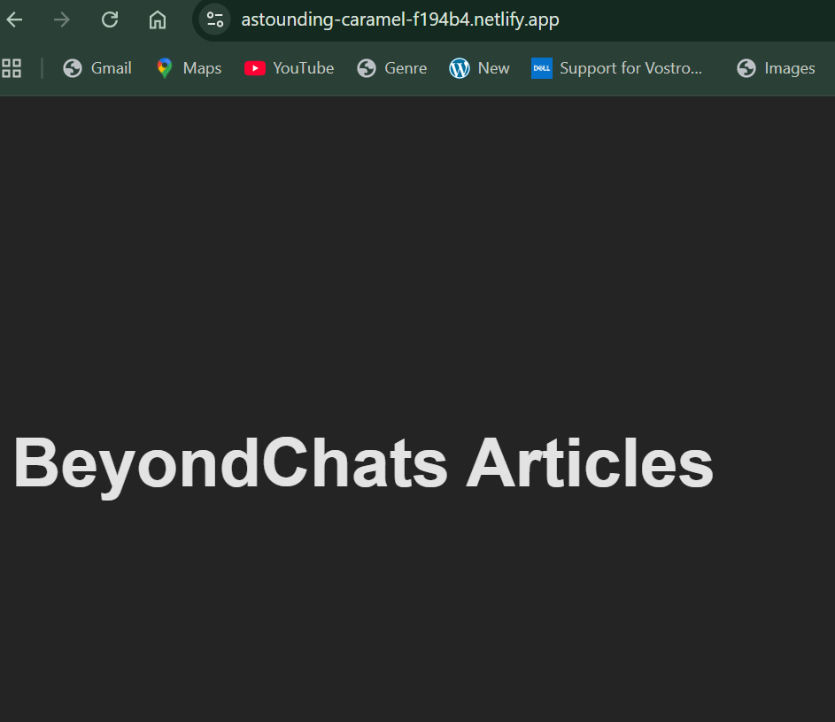

Full Stack Content Processing System
> Overview

This project is a full-stack content processing system built as part of the BeyondChats Full Stack Web Developer Intern assignment.
It demonstrates an end-to-end pipeline covering backend APIs, automated processing, and frontend visualization.

The system:

Scrapes articles

Stores them using a Laravel REST API

Processes them through a Node.js pipeline (Mock LLM + Mock Google Search)

Displays original and updated content in a React frontend

The application is divided into three clear phases, exactly as described in the assignment.

> Tech Stack

Backend API: Laravel (PHP)

Database: MySQL

Processing Pipeline: Node.js, Axios, dotenv

Frontend: React (Vite)

Tools: Postman, phpMyAdmin, Git, Netlify

> System Architecture
Scraped Articles
        ↓
Laravel REST API (MySQL)
        ↓
Node.js Processing Pipeline
(Mock Google Search + Mock LLM)
        ↓
Updated Articles
        ↓
React Frontend UI

> Phase 1 – Article Scraping & Backend API
✔ What was implemented

Scraped 5 articles initially (as required by the assignment)

Stored articles in MySQL using Laravel

Implemented full CRUD REST APIs

> API Endpoints
Method	Endpoint	Description
GET	/api/articles	Fetch all articles
POST	/api/articles	Create a new article
PUT	/api/articles/{id}	Update an article
DELETE	/api/articles/{id}	Delete an article
✔ Why 5 articles?

The assignment requires multiple articles to demonstrate:

Batch processing

Content transformation tracking

original_content vs updated_content

A realistic, real-world use case

Using only one article would not effectively demonstrate the system design.

> Phase 2 – Node.js Processing Pipeline
✔ What was implemented

Fetches articles from the Laravel API

Runs Mock Google Search

Runs Mock LLM content generation

Updates articles via API (updated_content, is_updated)

Note:
Real Google Search APIs and LLMs were intentionally mocked, as allowed and expected by the assignment scope.

✔ Example Pipeline Output
🔍 Processing article 2
🔍 Mock Google search for: "Postman test article"
✅ Updated article 2
🎉 Phase 2 pipeline finished

This proves automated processing and backend integration.

> Phase 3 – React Frontend
✔ What was implemented

Displays a list of articles

Shows:

Title

Original content

Updated content (if available)

Clearly distinguishes processed vs unprocessed articles

✔ Why the frontend matters

The frontend visually proves:

Backend APIs are working

Node.js pipeline updates data correctly

End-to-end system integration is complete

> How to Run the Project
1️⃣ Backend (Laravel)
cd backend
php artisan serve

Backend runs at:

http://127.0.0.1:8000

2️⃣ Node.js Processor
cd backend/node-processor
npm install
node llmProcessor.js

3️⃣ Frontend (React)
cd frontend
npm install
npm run dev

Frontend runs at:

http://localhost:5173

> Live Demo

Frontend deployed on Netlify:
👉 https://astounding-caramel-f194b4.netlify.app/

Note: Backend runs locally; frontend deployment is for UI demonstration.

. Environment Notes

.env files are used only where required

.env files are not committed to GitHub

Google Search and LLM functionality are mocked intentionally

MySQL managed via phpMyAdmin / XAMPP

> Screenshots

The repository includes screenshots of:

[Postman API Response](Screenshots/postman-api.png)
[Node Pipeline Logs](Screenshots/node-pipeline.png)

> Assignment Status

✔ Backend API complete
✔ Node.js processing pipeline complete
✔ Mock LLM + Mock Google Search implemented
✔ React frontend complete
✔ End-to-end data flow verified
✔ Live frontend deployed

👤 Author

Anushka Jana

Clean architectural thinking
